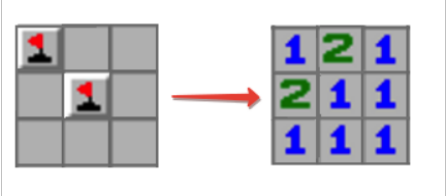

# Minesweeper (JAVA)

## Technical question:

In the popular Minesweeper game, you got an NxN board with cells. Some cells have mines in them. Other cells have numbers in them which indicates the total number of mines in th adjacent cells. Starting with a mine array, we want to create a sample Minesweeper board.

Implement the code to create the initial board.

##### For example:

- board_config = [[true, false, false],
          [false, true, false],
          [false, false, false]]

is a 3x3 board. True indicates mine locations, false indicates locations without mines.

For the sample configuration, the resulting

- minesweeper(board_config) = [[1, 2, 1],
                              [2, 1, 1],
                              [1, 1, 1]]

minesweeper is of the same dimension as board_config. Each cell contains an integer number equal to the number of mines in adjacent cells. Two cells are considered adjacent if they share at least one side.

#### Suggested inputs and expected outputs

In the repository template, the function "main(String[] args)" must receive the input paramenters with the following format:

- "matrix size (N)" "row 1 data" "row 2 data" ... "row N data"
- For example: "3" "true,false,false" "false,true,false" "false,false,false"
- The first parameter "matrix size (N)" is stored in the 'boardSize' variable.
- The other parameters "row # data" are read and added to the "rowConfiguration" list using the function "**readConfigurationData**". You can implement your own version if so desired.

It is expected that the resulting board is stored in the "initialBoard" variable, which is a NxN matrix, whose presentation is done by "showInitialBoard" method. It shows the following:

- The Minesweeper configuration is: [config. row 1],[config. row 2], ... ,[cofig. row N]
- Exameple: The Minesweeper configuration is: [1,2,1],[2,1,1],[1,1,1]
- The '**showInitialBoard**' method is already implemented. You must NOT delete this method, neither its implementation nor its use.

**TO CONSIDER:** We know of the existence of answer for this question on the internet, but we would like to know you analytic skills to solve this problem. We hope you have good alogoritmic skills to work properly within our team.
